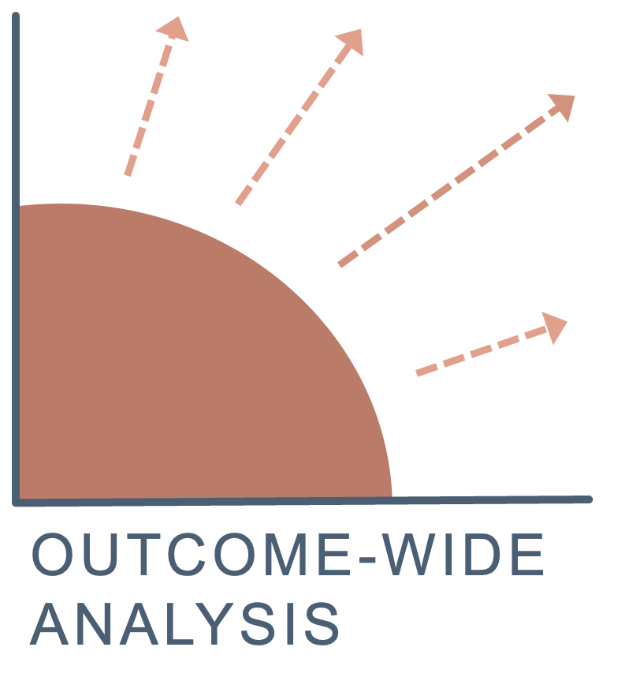

```{=html}

```

Outcome-Wide Analysis provides consulting support for researchers and public agencies working at the intersection of transportation, land use, and population health.

The work focuses on rigorous, policy-relevant analytic strategy, particularly when causal inference, spatial data, and public-health concepts intersect.

## Areas of expertise

* Epidemiologic and quasi-experimental methods for policy evaluation and place-based research, including case-control designs, generalized synthetic control, health impact assessment, and related approaches
* Analytic strategy under uncertainty, including clarifying study questions, weighing imperfect design options, and making defensible methodological decisions when no single approach is obvious
* Framing transportation and land-use questions within population-health and public-health frameworks
* Integration and harmonization of datasets across spatial, mobility, environmental, and administrative domains
* Scientific writing support for grants and manuscripts, especially sections covering methods and conceptual framing

## Background

Michael Garber, PhD, MPH is an epidemiologist whose work focuses on how transportation systems and urban design shape population health. He has authored 25+ peer-reviewed articles, including work published in *Epidemiology*, *The Lancet Planetary Health*, and *Journal of Transport & Health*, and received the 2022 Rothman Epidemiology Prize for methodological innovation.

## Contact
To discuss a possible project, please email: `michael@outcomewide.com`

## On the name
The name *Outcome-Wide Analysis* is a nod to Tyler VanderWeele’s 2017 article “Outcome-wide Epidemiology,” which has informed my approach to studying how upstream transportation and land-use decisions shape multiple outcomes across population health and climate resilience.